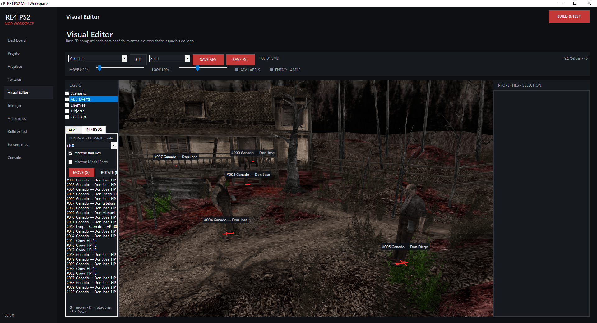

# RE4 PS2 MOD WORKSPACE — v0.5.0

> **WIP — Work in Progress**

> Only available in Portuguese for now.

**Requires .NET 8.0 Runtime** — [Download](https://dotnet.microsoft.com/en-us/download/dotnet/8.0)

## Português

O **RE4 PS2 MOD WORKSPACE** é uma ferramenta em desenvolvimento para facilitar o modding de **Resident Evil 4 para PlayStation 2**, integrando edição, gerenciamento e testes em um único workspace.

### Funcionalidades

- Criação e gerenciamento de projetos a partir da ISO
- Extração e repack de arquivos DAT
- Build & Test diretamente no PCSX2
- **Texture Manager**
  - Visualização, importação e exportação de texturas
  - Substituição por PNG e Drag & Drop
  - Edição de mipmaps
  - Resize, Rotate e Flip
  - Conversão 4-bit / 8-bit
- **Visual Editor**
  - Visualização 3D de cenários SMD
  - Texturas e transparência
  - Visualização e edição de triggers AEV
  - Seleção, movimentação, duplicação e exclusão de triggers
  - Editor de propriedades por tipo de AEV
  - Undo/Redo
- **Enemy / ESL Editor**
  - Leitura e edição de arquivos `emleonXX.esl`
  - Visualização dos inimigos no cenário
  - Edição de posição, rotação e propriedades
  - Suporte a modelos e animações de inimigos

### Dependências

Algumas funcionalidades dependem das seguintes ferramentas externas:

- **DAT Tool** (dentro do toolset) — [Link](https://residentevilmodding.boards.net/thread/9780/2018-re4uhd-toolset-persia-updated/)
- **ISOAFS v1.3.3** — [Link](https://github.com/christianmateus/RE4_PS2_ISOAFS_MANAGER/)
- **TPL Manager v1.3.2** — [Link](https://github.com/christianmateus/RE4_PS2_TPL_Manager/)
- **PCSX2 2.7+** — [Link](https://pcsx2.net/downloads/)

Mais funcionalidades serão adicionadas futuramente.

---

## English

**RE4 PS2 MOD WORKSPACE** is a work-in-progress tool designed to simplify **Resident Evil 4 PlayStation 2 modding** by integrating editing, management and testing into a single workspace.

### Features

- ISO project creation and management
- DAT extraction and repacking
- Build & Test directly with PCSX2
- **Texture Manager**
  - Texture preview, import and export
  - PNG replacement and Drag & Drop
  - Mipmap editing
  - Resize, Rotate and Flip
  - 4-bit / 8-bit conversion
- **Visual Editor**
  - 3D SMD scenario visualization
  - Texture and transparency support
  - AEV trigger visualization and editing
  - Trigger selection, movement, duplication and deletion
  - Per-type AEV property editor
  - Undo/Redo
- **Enemy / ESL Editor**
  - `emleonXX.esl` reading and editing
  - Enemy visualization inside scenarios
  - Position, rotation and property editing
  - Enemy model and animation support

### Dependencies

Some features currently depend on the following external tools:

- **DAT Tool** (inside the toolset) — [Link](https://residentevilmodding.boards.net/thread/9780/2018-re4uhd-toolset-persia-updated/)
- **ISOAFS v1.3.3** — [Link](https://github.com/christianmateus/RE4_PS2_ISOAFS_MANAGER/)
- **TPL Manager v1.3.2** — [Link](https://github.com/christianmateus/RE4_PS2_TPL_Manager/)
- **PCSX2 2.7+** — [Link](https://pcsx2.net/downloads/)

More features will be added in future versions.