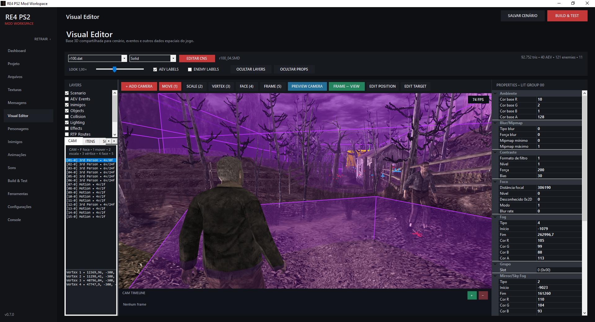

# RE4 PS2 MOD WORKSPACE — v0.7.0

> **WIP — Work in Progress**

> Interface em português e inglês; as traduções ainda estão em evolução.

**Requires .NET 8.0 Runtime** — [Download](https://dotnet.microsoft.com/en-us/download/dotnet/8.0)

## Português

O **RE4 PS2 MOD WORKSPACE** é uma ferramenta em desenvolvimento para facilitar o modding de **Resident Evil 4 para PlayStation 2**, integrando edição, gerenciamento, build e testes em um único workspace.

### Funcionalidades

- Criação e gerenciamento de projetos a partir da ISO
- Leitura nativa de ISO/AFS, navegação por arquivos, extração e substituição
- Extração individual ou em lote dos cenários
- Gerenciamento de DATs, backups e restauração dos arquivos originais
- Build rápido, Build All, recriação limpa da ISO e execução no PCSX2
- **Texture Manager**
  - Visualização, importação e exportação de texturas SMD e EFF
  - Substituição por PNG e Drag & Drop
  - Edição de mipmaps, resize, rotação e flip
  - Conversão 4-bit / 8-bit
- **Visual Editor**
  - Visualização 3D de cenários SMD
  - Edição de AEV, ESL, ETS, ITA, colisões, LIT, EFF, RTP, CAM e ambientes sonoros
  - Seleção, transformação, duplicação, exclusão e edição de propriedades
  - Importação e exportação de modelos OBJ/SMD, edição de materiais e catálogo de objetos reutilizáveis
  - Auto-save sem interromper a seleção, Undo/Redo e persistência de camadas, câmera e navegação
- Editores de inimigos, personagens, armas, áudio, arquivos CNS, animações FCV e mensagens MDT
- Exportação de animações FCV para edição no Blender e importação de volta
- Editor do executável com ajustes para testes na versão debug do jogo
- Interface traduzível com catálogos de idioma e opção de iniciar maximizado
- Feedback de carregamento e build, detecção de modificações e limpeza completa do workspace

### Dependências

Ferramenta necessária para testar a ISO:

- **PCSX2 2.7+** — [Download](https://pcsx2.net/downloads/)

Ferramenta opcional:

- **TPL Manager** — editor externo alternativo para arquivos TPL ([Link](https://github.com/christianmateus/RE4_PS2_TPL_Manager/))

Mais funcionalidades serão adicionadas futuramente.

---

## English

**RE4 PS2 MOD WORKSPACE** is a work-in-progress tool designed to simplify **Resident Evil 4 PlayStation 2 modding** by integrating editing, project management, building and testing into a single workspace.

The interface is available in Portuguese and English; translations are still being improved.

### Features

- ISO project creation and management
- Native ISO/AFS reading, file browsing, extraction and replacement
- Individual or batch scenario extraction
- DAT management with original-file backup and restore
- Fast Build, Build All, clean ISO recreation and direct PCSX2 testing
- **Texture Manager**
  - SMD and EFF texture preview, import and export
  - PNG replacement and Drag & Drop
  - Mipmap editing, resize, rotation and flip
  - 4-bit / 8-bit conversion
- **Visual Editor**
  - 3D SMD scenario visualization
  - Editing for AEV, ESL, ETS, ITA, collision, LIT, EFF, RTP, CAM and sound-environment data
  - Selection, transformation, duplication, deletion and property editing
  - OBJ/SMD model import and export, material editing and a reusable object catalog
  - Non-disruptive auto-save, Undo/Redo and persistent layer/camera/navigation settings
- Enemy, character, weapon, audio, CNS, FCV animation and MDT message editors
- FCV animation export for Blender editing and import back into the tool
- Executable editor with testing tweaks for the debug version of the game
- Translatable interface with language catalogs and a start-maximized setting
- Loading/build feedback, change detection and complete build-workspace cleanup

### Dependencies

Required for testing the ISO:

- **PCSX2 2.7+** — [Download](https://pcsx2.net/downloads/)

Optional tool:

- **TPL Manager** — alternative external TPL editor ([Link](https://github.com/christianmateus/RE4_PS2_TPL_Manager/))

More features will be added in future versions.

## Créditos / Credits

Agradecimentos a JADERLINK, LeonEx, kTeo, RE-Play games, zatarita e MrCurious pelos materiais de referência que contribuíram para o desenvolvimento da ferramenta.

Thanks to JADERLINK, LeonEx, kTeo, RE-Play games, zatarita and MrCurious for the reference materials that helped me develop this tool.
